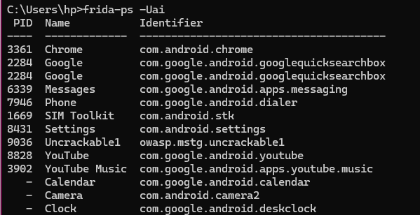
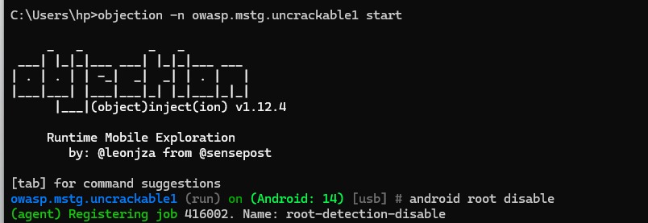
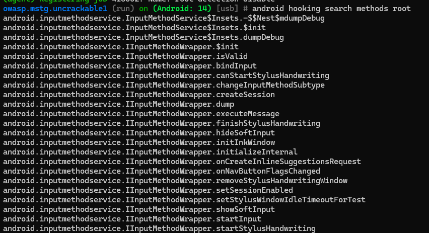

# Android Root Detection Bypass Lab

## 1. Introduction

Dans ce lab, j’ai analysé une application Android afin de contourner son mécanisme de détection du root.
L’objectif est de comprendre comment une application protège son environnement et comment ces protections peuvent être contournées à l’aide d’outils d’analyse dynamique.

---

## 2. Environnement de travail

Les outils utilisés sont :

* ADB pour communiquer avec l’appareil Android
* Frida pour l’instrumentation dynamique
* Objection pour simplifier les attaques

---

## 3. Application cible

L’application utilisée est : OWASP UnCrackable Level 1

Cette application est conçue pour tester les techniques de sécurité mobile.
Elle contient plusieurs protections comme :

* Détection du root
* Anti-debugging

## 4. Analyse du comportement initial

Lorsque l’application est lancée normalement :

* Elle détecte un environnement non sécurisé
* Elle bloque ou ne fonctionne pas correctement

Dans mon cas, l’application reste bloquée sur l’écran de démarrage.

## 5. Analyse dynamique avec Objection

J’ai utilisé Objection pour me connecter à l’application en cours d’exécution et interagir avec elle.

* Connexion réussie à l’application
* Accès à une console interactive
* Possibilité d’injecter des hooks

---

## 6. Tentative de bypass du root

J’ai utilisé les fonctionnalités d’Objection pour désactiver la détection du root.

Principe :

* Interception des fonctions liées à la détection
* Modification du comportement de l’application

Résultat obtenu :

* Le bypass a été partiellement appliqué
* Cependant, l’application reste bloquée sur l’écran de démarrage

Cela montre que l’application utilise également d’autres mécanismes de protection

---
## 7. Exploration de l’application

J’ai exploré les classes et méthodes de l’application pour identifier les parties liées à la sécurité.

Cela permet de mieux comprendre :

* Où se trouvent les vérifications
* Comment elles fonctionnent

---

